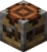

::: componentMeta

order=1

id=mods

classlist=wrap,card-grid

:::

::: div span-6

## Features{.large}

---

:::

::: div span-6 center

# **Economy ᚠ**

## Fehu (ᚠ) is the server currency.

:::

::: div card span-2 span-6-sm left
<small>**Buying + selling**</small>

- `/askaup` or `/market` — Open the store menu
- `/shop`, `/shops`, or `/ps` — Player shop menu
- `/auctionhouse` or `/ah` — Auction house menu
- `/orders` — Player orders GUI

:::

::: div card span-2 span-3-sm span-6-xs left
<small>**Basic commands**</small>

- `/bal` or `/money` — Show your Fehu balance
- `/money pay` — Send Fehu to other players
- `/baltop` — The richest players
  :::

::: div card span-2 span-3-sm span-6-xs left
<small>**Extra money methods**</small>

- `/withdraw` - Withdraw **Fehu (ᚠ)** into physical bank notes
- `/sellxp` - Sell **EXP/levels** for Fehu

:::

::: div span-6

---

:::

::: div span-6 center

# **Lands**

## Lands is a claim / grief-prevention / nation-war system with taxes and upkeep. Enemy nations can declare war and conquer claims even while you’re offline.{.centered}

:::

::: div span-2 card left
**Basic Info**

- Claims cost about **ᚠ1010 per chunk**
- Upkeep is collected at **11PM each day**
- Pay **taxes/upkeep** to maintain claims
- Declare war to **conquer land** or use diplomacy to form alliances
- **Rent or sell** parts of your nation
- Configure claim settings like **fire tick** and **mob spawning**

:::

::: div span-4 card left
**Commands**

- `/lands` — Lands menu
- `/lands create` - Opens Land creation GUI
- `/lands createcamp` - Create a temporary land that will be deleted after a specific period. (no upkeep)
- `/lands claim radius 0` — Claim the single chunk you’re standing in
- `/lands selection` — Adds a claim tool to your hand.
  - **This may appear to delete or dupe the item you had in your hand, but it is only a visual bug.**

:::

::: div span-6

---

:::

::: div span-6 center

# Progression + Stats

## Battlepass for rewards, PlayerStats for tracking and comparing, and Tool Stats for personalized items.{.centered}

:::

::: div span-2 span-3-sm span-6-xs card left
**Battlepass**

- Quest-based rewards system for **Fehu** and items
- Monthly resets, ongoing updates
- `/bp` — Opens Battlepass GUI

:::

::: div span-2 span-3-sm span-6-xs card left
**PlayerStats**

- Share your stats in chat + leaderboards for basically everything
- [Read more on SpigotMC](https://www.spigotmc.org/resources/playerstats.102347/)

:::

::: div span-2 span-6-sm card left
**Tool Stats**

- Items track history and performance via NBT tags (crafted/looted, damage dealt/taken, blocks broken, etc.)

:::

::: div span-6

---

:::

::: div span-6 center

# World + Exploration

## Overworld generation overhauled with Terralith+ custom dimensions and structures from Yggdrasil and Stellarity.{.centered}

:::

::: div span-2 span-6-sm card left

**Stellarity (End content)**

- Largely improved End dimension
- New biomes, structures, mobs, elytras,
- Super rare post dragon fight content
- Summoning ritual to fight the Ender Dragon again
- [Learn More on the official wiki](https://koharasbasement.wiki.gg/wiki/Stellarity)

:::

::: div span-2 span-3-sm span-6-xs card left

**Yggdrasil**

- Quest line + massive exploration structures with rare loot
- Adds a **new dimension** full of labyrinthine dungeons
- [Learn More on the official wiki](https://hardels-organization.gitbook.io/voxel/yggdrasil/getting-started)

:::

::: div span-2 span-3-sm span-6-xs card left

**Web map**

- Map: http://play.valhallamc.ca:8101/
- Land claims are visible on the world map
- 3D-models of the whole world surface allow you to see your builds in teh browser.
- `/webmap` — Get the browser map link

:::

::: div span-6

---

:::

::: div span-6 center

# Items + Cosmetics + QoL

## Custom textures, music, tool trims, food improvements, and more.{.centered}

:::

::: div card span-2 left
**Cosmetics + Resources**

- Merged resourcepacks for broad reskins and easier updates
- **40+ custom music discs** (from creepers + naturally generated chests + fragments)
- **Tool Trims:** 4 lootable templates usable on all tools/weapons (1200+ combinations)
  - [Read more on Modrinth](https://modrinth.com/plugin/tooltrims)

:::

::: div card span-2 left

**Farming + Other QoL**

- **Smart Spawners:** silk-touch spawners + easy item/xp collection (natural or purchased)
- **Villager Transportation:** llama + lead method (villager mounts llama for easier movement)
- **Better Beacon Range:** beacons reach further and buff a larger area
- **Food Balance:** foods have unique effects and are more balanced
  - [Read more on Modrinth](https://modrinth.com/datapack/food-balance)

:::

::: div card span-2 left

**Villager + Dog QoL**

- Villager trades are mostly vanilla
- Librarians have **more book trades**
- Villagers can be mounted on Llamas for transport
- Tamed wolves have **improved AI** and pathfinding
  - ctrl+right click dog to cycle classic/patrol/peaceful modes
- Tamed wolves passively regen HP over time, and will heal from "scavenging" rotten flesh that has been dropped within it's proximity

:::

::: div span-6

---

:::

::: div span-6 center

# Risk + Fun

## Coinflipz gambling, Horde Nights, Mooshroom Energy, and MooshDonalds for you absolute degens.{.centered}

:::

::: div card span-2 left

**Coinflipz**

- Coin Flip: 1v1 betting where players can challenge each other to a coin flip
- Roulette: Multi-player roulette table where multiple players can place different types of bets
- `/coinflipz` — Open Coinflipz menu
- `/coinflipz stats` — View your Coinflipz stats

:::

::: div card span-2 left
**Horde Nights**

- Extra-danger nights every **35 in-game nights**
- Adds custom advancements/enchantments and other experimental features
- _(Sleep Vote usually overrides normally unskippable horde nights.)_
- `/sleep` — Vote to skip night or storms

:::

::: div card span-2 left

**Mooshroom Energy & MooshDonalds**

- Turns underused items into powerful consumables
- Monster Energy potions give speed, jump boost, and regeneration
- MooshDonalds provide unique buffs and effects
- All items are craftable with custom recipes
- [Read more on Modrinth](https://modrinth.com/modpack/energy)

:::

::: div span-6

---

:::

::: div span-6 center

# Voice + furniture resources

:::

::: div span-3 span-3-sm span-6-xs center

<small>**Simple Voice Chat**</small>

[Read more on Modrinth](https://modrinth.com/plugin/simple-voice-chat){.btn}

:::

::: div span-3 span-3-sm span-6-xs center

<small>**Furnicraft**</small>

[Read more on Modrinth](https://ketket.dev/docs/category/-furnicraft){.btn}

:::

::: div span-6

---

:::

::: div span-6 centered

# Useful commands (quick list)

:::

::: div card span-2 left

### Economy + trading

- `/askaup` or `/market` — Store menu
- `/bal` or `/money` — Fehu balance
- `/money pay <player> <amount>` — Pay other players
- `/baltop` — Richest players
- `/auctionhouse` or `/ah` — Auction house
- `/shop`, `/shops`, or `/ps` — Player shops
- `/orders` — Player Orders GUI
- `/trade <player>` — Trade menu with another player
- `/withdraw <amount>` — Withdraw Fehu into physical bank notes
- `/sellxp <amount>` — Sell EXP/levels for Fehu
- `/sell` — Opens sell all GUI
- `/marketcollect` — Collect sold items from the auctionhouse and player shops

:::

::: div card span-2 span-3-sm span-6-xs left

### World + utility

- `/lands` — Lands menu
- `/sleep` — Skip night/storms vote
- `/wild` — Random wilderness teleport
- `/webmap` — Map link
- `/website` — Link back to this page
- `/store` — Server store link

:::

::: div card span-2 span-3-sm span-6-xs left

### Progress + UI

- `/bp` — Battlepass GUI
- `/sb` — Toggle sidebar/scoreboard
- `/coinflipz` — Coinflipz menu
- `/stats <stat>` — View PlayerStats
- `/timeplayed` — View total time played
- `/spawner hologram` — Toggle spawner holograms
- `/rules` — View server rules

:::
